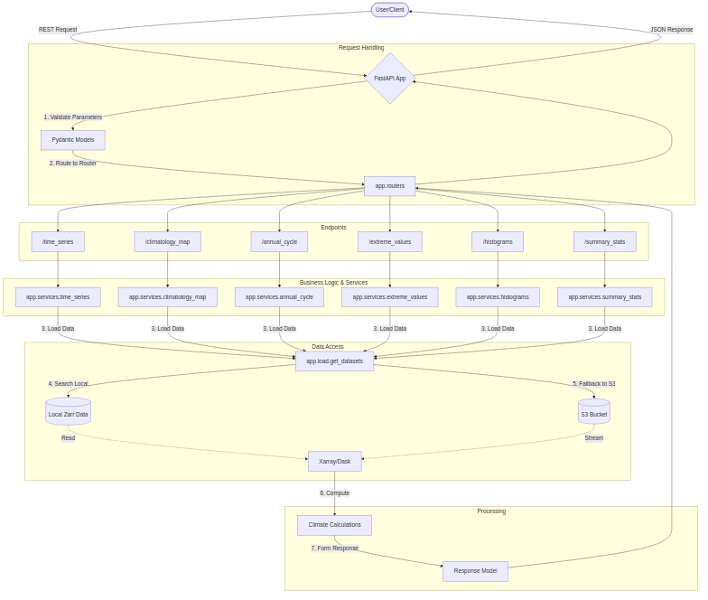

Welcome to OSCARS RSOTC Backend documentation!
===============================================

The OSCARS RSOTC Backend is a powerful FastAPI-based service designed for climate data analysis and processing.
It provides a robust API for interacting with climate datasets, calculating statistics, and generating the inputs for the visualizations.

Project Overview
----------------

This project serves as the backend for the OSCARS RSOTC (Regional State of the Climate).
It handles the heavy lifting of data retrieval from local storage or S3 (Zarr format), performs complex climate calculations using xarray and dask, and provides structured responses to frontend applications.

Key Features
------------

* **Annual Cycle Analysis**: Calculate daily statistics (percentiles, median, extremes).
* **Climatology Maps**: Generate spatial data for climate averages and anomalies.
* **Extreme Values**: Identify and analyze climate extremes based on standard indices.
* **Histogram Generation**: Create frequency distributions for climate variables.
* **Time Series Extraction**: Retrieve and process temporal data for specific regions.
* **Summary Text**: Generate narrative climate summaries.

.. toctree::
   :maxdepth: 2
   :caption: Getting Started:

   installation
   development

.. toctree::
   :maxdepth: 2
   :caption: API Reference:

   _api/index

Indices and tables
==================

* :ref:`genindex`
* :ref:`modindex`
* :ref:`search`
